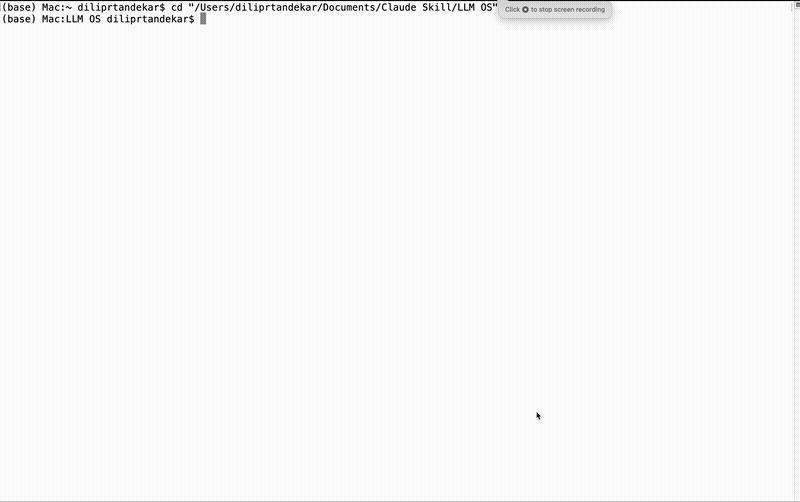
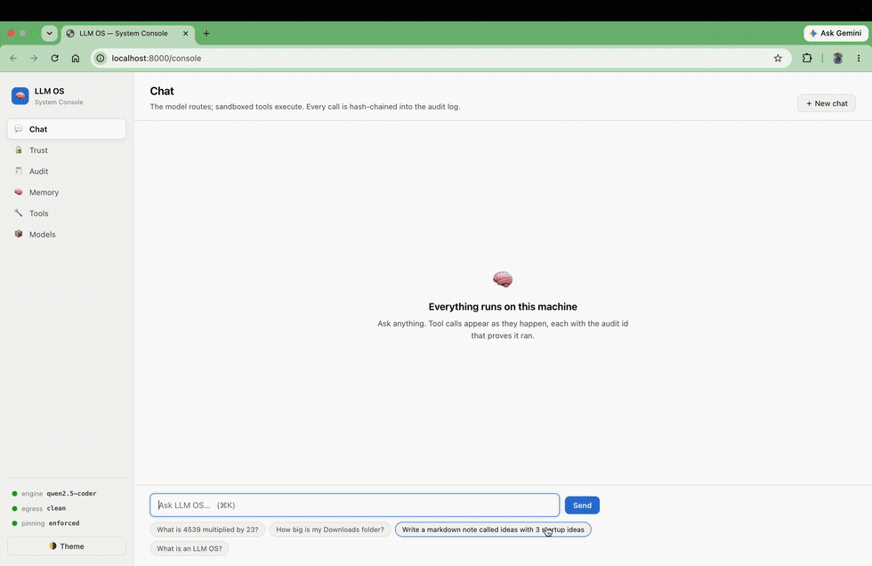

# 🧠 LLM OS — a private, local-first agentic kernel

**Everything runs on your machine. Nothing leaves it.**



*One unedited take: the demo script disables the Wi-Fi radio on camera → **TRUE AIRPLANE MODE** → math routing, sandboxed file generation, MCP disk tools, cross-session memory — then the verification suite closes with `Mode: OFFLINE — egress impossible by construction`. Full-resolution video: [docs/demo.mp4](docs/demo.mp4). Reproduce it yourself: `./scripts/demo.sh`.*

LLM OS is an implementation of [Andrej Karpathy's LLM OS idea](https://x.com/karpathy/status/1723140519554105733) built for one uncompromising constraint: **zero egress**. A small local language model acts as the CPU — it only *routes intent*. Deterministic, sandboxed tools do the actual work, and every decision is written to a tamper-evident audit log.

> **Built on LLM OS:** [**TelecomOS**](https://github.com/Indianinnovation/telecomos) — zero-egress network intelligence for 5G: root-cause analysis, alarm-storm correlation, and human-gated self-healing, all air-gapped. 19 MCP tools, a NOC dashboard, and a closed loop where the agent *proposes* but only an authorized human can *approve* — with the audit chain as the approval record. It's what a vertical built on this kernel looks like.

```
┌────────────────────────────────────────────────────────────────────┐
│  UI / any client            HTTP (localhost only)                  │
│      │                                                             │
│      ▼                                                             │
│  KERNEL (FastAPI)                          ┌────────────────────┐  │
│   • routes intent via native tool-calling  │ PREFLIGHT GATE     │  │
│   • validates all tool params (Pydantic)   │ telemetry off ·    │  │
│   • hash-chained audit log of every action │ loopback-only ·    │  │
│   • model digest pinning (refuses drift)   │ model pinned · …   │  │
│   • egress sentinel (watchdog, 3s)         └────────────────────┘  │
│      │                │                       │                    │
│      ▼                ▼                       ▼                    │
│  LLM ENGINE       BUILT-IN TOOLS          MCP SERVERS (stdio)      │
│  (Ollama, frozen   • calculator            • system-info           │
│   GGUF weights,      (AST whitelist)       • disk-inspector        │
│   loopback only)   • markdown writer       • any Claude-Desktop-   │
│                      (jailed dir)            format server         │
│      │             • remember /                                    │
│      ▼               search_memory                                 │
│  EPISODIC MEMORY (local ChromaDB, MemGPT-style paging)             │
└────────────────────────────────────────────────────────────────────┘
```

## The System console — see every guarantee, live



*Chat streams token by token with each tool call shown live (and its audit id); the Trust panel says **All guarantees hold**; every answer is in the hash-chained audit log. Full video: [docs/console_demo.mp4](docs/console_demo.mp4).*

Most local-AI tools ask you to *trust* them. LLM OS ships the control
plane that lets you **check**: open **http://localhost:8000/console**
(served by the kernel itself — no extra process, no dependencies, works
in the Docker sandbox).

| Panel | What it answers |
|---|---|
| 💬 **Chat** | Ask anything — answers **stream token by token**, each tool call appears live as a chip with its audit id, follow-ups work, and **chats are saved** (they survive a refresh, a restart, a reboot) |
| ⏰ **Schedules** | Agents that run on their own — "every morning, check disk usage and report" — with runs, next-run times, and any approvals they are waiting on |
| 📄 **Documents** | Drop your files in `documents/` and ask about them — answers come back **with citations** (`sample-nda.md (chunk 1/1)`), indexed and read entirely on this machine |
| 🔒 **Trust** | Are all 12 privacy checks passing *right now*? Has the egress sentinel seen anything leave? Is the model digest still pinned? |
| 🧾 **Audit** | Every routing decision and tool execution, hash-chain verified — searchable, and exportable as signed-in-order JSONL for an auditor |
| 🧠 **Memory** | Everything the system remembers about you — searchable, and **erasable** (one record, or all of it) |
| 🔧 **Tools** | Every tool the model may call, its source (`builtin` vs `mcp:<server>`), call counts, failures, and latency |
| 📦 **Models** | Which weights are approved, which are pinned, which is active — and a loud red flag if any digest drifts |

This is the surface a CTO, a compliance officer, or a security reviewer
actually needs: not "we promise nothing leaves," but a page that says
*nothing has left, here is the log, here is the proof, delete anything
you want.*

## Ask your own documents — with citations

```bash
cp ~/contracts/*.md documents/     # your files, on your machine
curl -X POST localhost:8000/documents/reindex
```

> **You:** What is the liability cap in my NDA, and which law governs it?
> ⚙ *search_documents · audit ee0d7301a20d*
> **LLM OS:** The liability cap is **USD 250,000**, except for breaches of
> Section 4 (Confidentiality). Governing law: **State of Delaware**.
> *— sample-nda.md (chunk 1/1)*

Local embeddings, local index, cited answers. A lawyer can use this without
writing a line of code, and nothing is uploaded anywhere.

## Human approval gates — the model proposes, you authorize

Any tool can be marked human-gated. The kernel then **refuses to run it**
until a person approves — the gate is state the kernel checks, not an
instruction in a prompt:

```bash
LLM_OS_APPROVAL_TOOLS=write_markdown python scripts/launch.py
```

> **You:** Write a markdown note called quarterly-report…
> ✋ **write_markdown needs your approval** — `{"filename": "quarterly-report", …}`
> `[Approve & run]` `[Reject]`

The request, the decision, the approver, and the execution each become
records in the audit chain. This is what makes "give the agent write access"
safe — and it's how you'd gate `send_email` or `execute_change` in your own
MCP server.

## Scheduled agents — work that happens while you sleep

> *"Every morning at 08:00, check disk usage and write me a report."*

Create a job in the console's **Schedules** panel (or `POST /schedules`), and
the kernel runs it on its own — same tools, same memory, same hash-chained
audit trail as if you had typed it.

**And the same approval gates.** A 3am job that wants to touch a gated tool
does **not** get to authorize itself: it leaves a pending request and a human
decides in the morning.

```
Nightly report   every 60m   next 01:00   ✋ awaiting approval
Morning check    daily 08:00 next 08:00   ✓ get_disk_usage
```

That is what earns the "OS" in the name: it does work for you, and it still
cannot do anything you did not permit.

## Why

Regulated teams (legal, healthcare, finance) are blocked from cloud AI by
confidentiality obligations. LLM OS gives them agentic automation with:

- **Zero egress, enforced** — the model runs on a Docker network with `internal: true`; there is no route to the internet, not just a promise.
- **The LLM never executes anything** — it emits structured tool calls; the kernel validates and runs them. No `eval()`, anywhere: math goes through an AST-whitelist evaluator, file writes are jailed to a sandbox directory.
- **Tamper-evident audit** — every routing decision and tool execution is a JSONL record hash-chained to the previous one. Edit one byte of history and `GET /audit` reports the chain broken.
- **Flat cost** — no API tokens. A 3B model on a laptop is enough, because the model only routes.

## Quickstart

One command — it checks Python, starts the engine **hardened**
(loopback-only, vendor cloud features off), pulls the models, builds the
venv, pins the model digests, runs preflight, and launches:

```bash
./install.sh
```

Then open **http://localhost:8000/console**.

<details>
<summary>Manual setup (if you prefer)</summary>

Requires [Ollama](https://ollama.com) with a tool-calling model:

```bash
ollama pull llama3.2      # the routing model
ollama pull all-minilm    # 46 MB embedding model for episodic memory

# The engine, hardened: loopback-only, vendor cloud features OFF
# (Ollama ships OLLAMA_NO_CLOUD=false — see "Hardened native mode" below)
OLLAMA_HOST=127.0.0.1:11434 OLLAMA_NO_CLOUD=1 ollama serve

python3 -m venv .venv && source .venv/bin/activate
pip install -r requirements.txt

python scripts/launch.py
```
</details>

The launcher is a **preflight gate** — 12 checks that must pass before
anything starts: no vendor update channel (desktop app not running),
engine bound to loopback with **cloud features disabled** and zero
external connections, UI and vector-store telemetry off, **model digests
pinned**, valid MCP config, models present, disk headroom. A failure
blocks startup and prints the exact fix:

```
🔒 LLM OS preflight — recommended settings
  ✓ No vendor update channel         bare ollama daemon (no desktop app)
  ✓ Engine bound to loopback         127.0.0.1
  ✓ Engine cloud features off        OLLAMA_NO_CLOUD=1
  ✓ Model digest pinned              'llama3.2:latest' matches pinned digest a80c4f17…
  ✓ Vector-store telemetry disabled  anonymized_telemetry=False
  …
  All critical checks passed.
```

`--check-only` audits without starting; `--approve-models` pins the
digests of the models you trust; `--docker` gates and launches the
container sandbox; `--stop` shuts everything down. To start components
by hand instead:

```bash
uvicorn llm_os.api:app --port 8000    # kernel
streamlit run ui/app.py               # web console
```

Open http://localhost:8501 and try:

- *"What is 4539 multiplied by 23?"* → routed to the `calculator` tool
- *"Write a markdown note called project-ideas listing 3 startup ideas"* → routed to `write_markdown`, file appears in `scratchpad/`
- *"How big is my Downloads folder?"* → routed to the `disk-inspector` MCP server
- *"Remember that my favorite city is Mumbai"* → stored; recalled in any later session
- *"What is an LLM OS?"* → answered directly, no tool

## Quickstart (Docker sandbox)

```bash
docker compose up --build -d
docker exec llm_engine ollama pull llama3.2
```

UI: http://localhost:8501 · Kernel API: http://localhost:8000/docs

Hard resource ceilings (4 CPU / 4 GB for the engine) prevent host memory
exhaustion. Both published ports bind to `127.0.0.1` only.

> **Apple Silicon note:** Docker cannot use the Metal GPU, so the engine
> runs CPU-only in the sandbox. For fastest local inference run Ollama
> natively (first quickstart) — the container topology is intended for
> Linux servers and VPC deployment.

## API

| Endpoint | Purpose |
|---|---|
| `POST /chat` | Route a prompt (optionally with `history` for follow-ups); returns the reply, the full tool trace (with audit ids), and any memories paged in |
| `POST /chat/stream` | Same, as server-sent events: `tool_start` → `tool` → `token`… → `done` |
| `GET /health` | Kernel + engine status, MCP servers, memory records, **model pinning**, **egress-sentinel violations** |
| `GET /tools` | Registered tools, each labelled `builtin` or `mcp:<server>` |
| `GET /audit?n=20` | Last N audit records + hash-chain verification result |

## Adding a tool

One module, one `TOOL` object — a name, a description, a Pydantic
parameter model, and a handler (see `llm_os/tools/calculator.py`), then
register it in `llm_os/tools/__init__.py`. Parameters are validated
before your handler runs; execution is automatically audit-logged.

## MCP: plug in any local tool server

The kernel is an **MCP host**. Drop server definitions into
`mcp_servers.json` using the same format as Claude Desktop:

```json
{
  "mcpServers": {
    "system-info": {
      "command": "python",
      "args": ["examples/system_info_server.py"]
    }
  }
}
```

On startup the kernel spawns each server over stdio, discovers its
tools, and routes to them exactly like built-ins — every call still
lands in the hash-chained audit log. `GET /tools` labels each tool's
origin (`builtin` vs `mcp:<server>`). Two fully offline example
servers are bundled:

- **system-info** — local time, whole-disk usage, OS details
- **disk-inspector** — read-only filesystem analytics jailed to your
  home directory: folder sizes ("how big is my Downloads folder?"),
  space breakdowns, and content-hash duplicate detection — with hard
  caps on entries walked and bytes hashed, and forgiving path
  resolution ("download folder" → `~/Downloads`)

A real third-party example, in its own repo with its own virtualenv:
[TelecomOS](https://github.com/Indianinnovation/telecomos) registers 19
tools (5G diagnostics, spec citations, human-gated remediation) and the
kernel routes to them with no code changes here — that is the whole
point of the MCP layer.

It works in reverse too: `python -m llm_os.mcp_server` exposes the LLM
OS built-in tools (sandboxed calculator, jailed markdown writer) to any
other MCP host, such as Claude Desktop.

## Episodic memory (MemGPT-style paging)

If the context window is RAM, the local vector store is disk. Every
exchange is archived into a persistent ChromaDB collection under
`memory_store/`, embedded by the local engine (`all-minilm`) — no
external calls. Before routing a new prompt, the kernel **pages in**
the most relevant memories (cosine-filtered) as context, so facts
survive across sessions and restarts:

```
You  › Remember that my company is called Acme Legal.        (session 1)
You  › What is my company called?                            (session 2)
LLM OS › Your company is called Acme Legal.   🧠 paged in 1 memory
```

The model also gets two agentic memory tools: `remember` (save a
durable fact) and `search_memory` (explicit lookup). Disable memory
entirely with `LLM_OS_MEMORY=0`, and browse or erase anything it holds
from the console's Memory panel.

**Memory never stores the assistant's own replies** — only what the user
said (plus which tools answered). Archiving model output creates a
feedback loop: a wrong answer gets recalled later *as fact*, and the
model repeats it instead of calling the tool. We hit exactly that bug in
testing; live data now always comes from a tool call.

## Prove it: airplane-mode verification

"Zero egress" is a claim; this script is the proof:

```bash
python scripts/verify_airplane_mode.py
```

It exercises every routing path (calculator, sandboxed file writes, MCP
tools, cross-request memory, plain chat), verifies the audit hash
chain, and proves nothing left the machine — two ways:

- **Machine online:** samples every TCP connection opened by the
  engine, kernel and UI processes for the entire run and fails on any
  non-loopback destination.
- **Machine offline:** true airplane mode — full functionality with no
  internet route at all. This is the demo to screen-record, and
  `./scripts/demo.sh` choreographs the whole thing: it disables the
  Wi-Fi radio itself (menu-bar toggles get undone by auto-join) and
  walks every feature on camera.

The offline detection requires **actual response bytes**, not just a
TCP handshake — local VPN agents (e.g. Cisco AnyConnect) accept
connections even with the radio off and will fool naive probes; ours
learned that the hard way. A markdown report is written to
`scratchpad/airplane_report.md`.

## Your data: verifiable guarantees

Cloud providers offer a *policy* ("we don't train on your data") that
can change. LLM OS offers a *physical property* of frozen weights
running offline — and every claim below is a command you can run, not
a promise you have to trust.

**1. The model cannot learn from your data.** Ollama runs GGUF weights
through llama.cpp in inference-only mode: no training loop, no gradient
code path, no way for a prompt to modify the model. Prove it — hash the
weights, feed them a secret, hash again:

```bash
BLOB=$(ls -S ~/.ollama/models/blobs/sha256-* | head -1)
shasum -a 256 "$BLOB"
curl -s -X POST http://localhost:8000/chat -H 'Content-Type: application/json' \
  -d '{"prompt": "My secret record number is MRN-778899. What is 12 times 12?"}'
shasum -a 256 "$BLOB"   # byte-for-byte identical
```

**2. There is nowhere to send your data.** Every network destination in
the codebase is loopback:

```bash
grep -rEoh "https?://[a-zA-Z0-9.-]+" llm_os/ ui/ examples/ --include="*.py" | sort -u
# http://localhost:11434
# http://localhost:8000
```

No vendor endpoint, no telemetry, no analytics. The airplane-mode
script above verifies this at the network level on every run.

This includes third-party libraries, which we audit rather than trust:
ChromaDB ships PostHog product telemetry **enabled by default** and
Streamlit gathers usage statistics **by default** — both are disabled
by policy here (`anonymized_telemetry=False` in the memory client,
`gatherUsageStats = false` in `.streamlit/config.toml`), with a
regression test so neither can silently return.

**3. Everything the system knows about you is three local folders.**

```bash
du -sh scratchpad audit memory_store   # documents · audit log · memory
rm -rf scratchpad audit memory_store   # …and now it knows nothing
```

Stored for your benefit (recall, audit), never transmitted, gone the
moment you delete them.

### Untrusted-model containment

LLM OS assumes the model itself could be wrong, tampered with, or
malicious — and contains it mechanically, so **switching models never
changes the security posture**:

- **The model can only emit tool calls, never execute.** Parameters are
  schema-validated; tools are deny-by-default (only registered ones
  exist), sandboxed, and audited.
- **Model digest pinning.** `model_manifest.json` pins the SHA-256
  digest of every approved model. At startup the kernel verifies the
  active model against its pin and **refuses to serve** on any
  mismatch — a swapped, re-tagged, or silently updated model file
  cannot run. Approving models is an explicit human action:
  `python scripts/launch.py --approve-models`.
- **Continuous egress sentinel.** A watchdog inside the kernel samples
  the TCP connections of the whole stack (kernel, MCP servers, engine)
  every few seconds; any non-loopback destination is written to the
  tamper-evident audit chain as an `egress_violation` and surfaced on
  `/health`. Nothing can leak quietly between airplane-mode runs.

### Hardened native mode: no vendor connection at all

*The caveat, found live:* the Ollama **desktop app** auto-updates, and
we caught its engine process holding a TLS connection to `ollama.com`
(verified via certificate CN) on a dev machine. It's connection
metadata, never prompt content — but a privacy-first stack shouldn't
have a live channel to any vendor. The fix is to skip the desktop app
and run the bare daemon (same binary, same models, no updater):

```bash
# 1. Quit the Ollama menu-bar app, and remove it from
#    System Settings → General → Login Items
# 2. Run the bare server: loopback-only AND cloud/remote features off
OLLAMA_HOST=127.0.0.1:11434 OLLAMA_NO_CLOUD=1 ollama serve
# 3. Verify: zero non-loopback connections, before and after inference
lsof -n -P -i TCP -a -p $(pgrep -f "ollama serve") | grep -v 127.0.0.1
```

**`OLLAMA_NO_CLOUD=1` matters.** Recent Ollama versions ship
`OLLAMA_NO_CLOUD: false` and `OLLAMA_REMOTES: [ollama.com]` **by
default — in the bare daemon, not just the desktop app**. Our egress
sentinel caught the daemon opening a TLS connection to ollama.com
(34.36.133.15:443, certificate CN verified) and recorded it in the
audit chain as an `egress_violation`; setting `OLLAMA_NO_CLOUD=1`
stops it. This is exactly what the sentinel exists for — the guarantee
is enforced and logged, not assumed.

The bare daemon then only touches the network when you explicitly
`ollama pull`. Optionally block the vendor domain outright
(model pulls via `registry.ollama.ai` keep working):

```bash
sudo sh -c 'echo "0.0.0.0 ollama.com www.ollama.com" >> /etc/hosts'
```

For client/production deployments, use the Docker topology — the
engine lives on an `internal: true` network with no route out, making
this entire class of connection structurally impossible.

## Routing evals

Small models route imperfectly; this repo measures it instead of hiding
it. A 64-prompt golden set across 6 categories (including trap prompts
that mention calculators, disks and files but need **no** tool, and a
24-prompt telecom category exercising the TelecomOS toolset) scores
tool selection, execution success, and exact math results:

```bash
python scripts/run_evals.py --models llama3.2,qwen2.5-coder
```

Results on this machine (2026-07-10, temperature 0):

| category | minicpm5 (1B, 0.7GB) | llama3.2 (3B, 2GB) | qwen2.5-coder (7B, 4.7GB) |
|---|---|---|---|
| calculator | 92% | 100% | 100% |
| write_markdown | 62% | 100% | 100% |
| MCP tools | 100% | 100% | 100% |
| memory | 17% | 83% | 100% |
| chat (no tool expected) | 50% | 0% | 75% |
| telecom (24 prompts, [TelecomOS](https://github.com/Indianinnovation/telecomos)) | — | 88% | **96%** |
| **overall (core 40)** | **68%** | **78%** | **95%** |

Routing quality scales with parameters, but not uniformly: the 1B
model beats the 3B at knowing when *not* to call a tool, while being
far weaker at memory tools. Pick per deployment: 1B for constrained
hardware, 7B when routing precision matters.

Two kernel features came directly out of these evals: math-notation
normalization (`5^2`, `√`, `7!`, `math.` → valid expressions) and a
**correction loop** that recovers tool calls emitted as raw JSON text
by models whose chat templates lack structured tool support. The
remaining llama3.2 weakness is over-eager tool calling on general
questions — it still answers them after the wasted call (graceful
degradation), but pick a ~7B model if routing precision matters.

## Tests

```bash
pip install -r requirements-dev.txt
pytest
```

72 tests: sandbox-escape attempts against the expression evaluator,
path-traversal attacks on the file tool, audit-chain tamper detection,
model digest-pinning enforcement, egress-sentinel behavior, and
telemetry-off regression guards — all with a mocked LLM, no engine
needed.

## Roadmap

- [x] MCP host: third-party tools plug in as MCP servers
- [x] Episodic memory: local vector DB with MemGPT-style paging
- [x] Airplane-mode verification script (scripted proof of zero egress)
- [x] Routing accuracy eval harness across models/quantizations
- [x] Untrusted-model containment: digest pinning + egress sentinel
- [x] Preflight gate: recommended privacy settings enforced before startup
- [x] First vertical built on the kernel: [TelecomOS](https://github.com/Indianinnovation/telecomos)
- [ ] Swappable engine adapter (llama.cpp `llama-server`, vLLM) via OpenAI-compatible API
- [x] Conversation persistence · document Q&A with citations · human approval gates (v0.2)
- [x] Scheduled/background agents (jobs run through the same kernel — and the same approval gates)
- [ ] Desktop installer (Tauri)

## License

Apache 2.0
